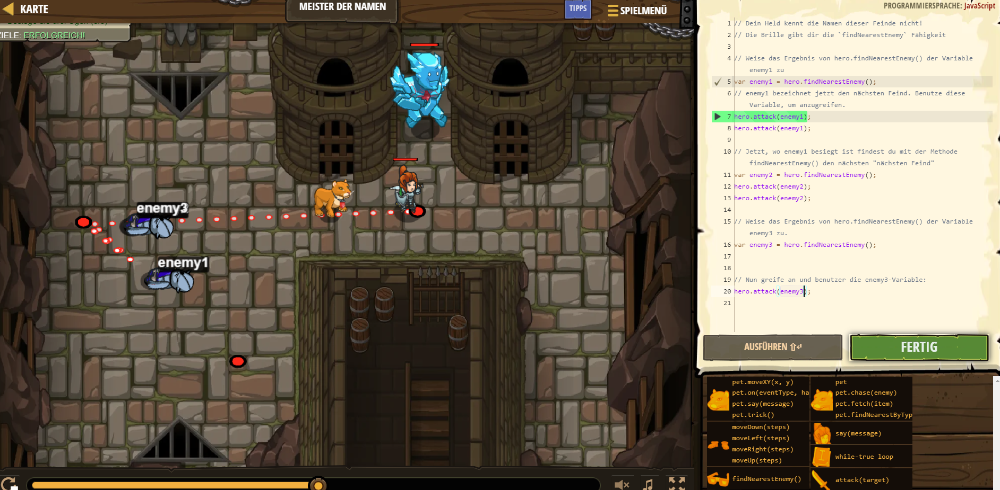

# CodeCombat Welt 1 Markdown 
## Level 16 Meister der Namen
```
Hier habe ich gelernt, wenn ein gegner in der nähe ist greift mein charakter direkt an.
hero.attack(enemy1);
hero.attack(enemy1);
var enemy2 = hero.findNearestEnemy();
hero.attack(enemy2);
hero.attack(enemy2);
var enemy3 = hero.findNearestEnemy();
hero.attack(enemy3);
```
