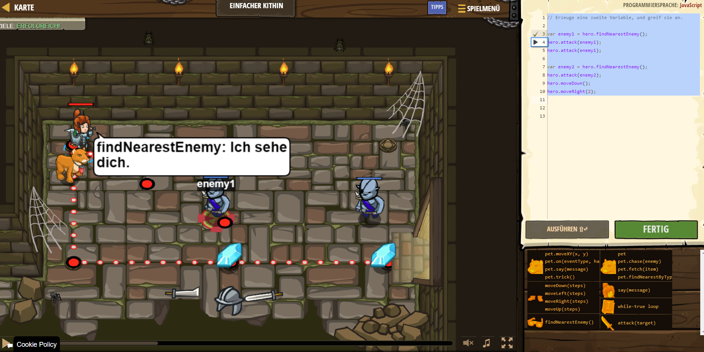

# CodeCombat Welt 1 Markdown
## Level 34 Einfacher Kithin
```
var enemy1 = hero.findNearestEnemy();
hero.attack(enemy1);
hero.attack(enemy1);
var enemy2 = hero.findNearestEnemy();
hero.attack(enemy2);
hero.moveDown();
hero.moveRight(2);
```
