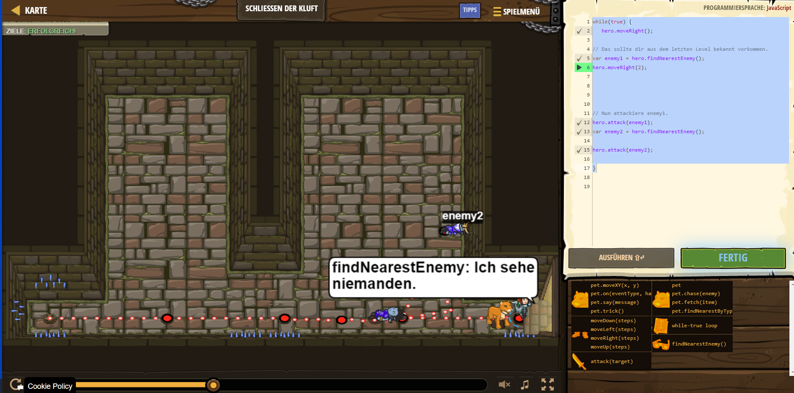

# CodeCombat Welt 1 Markdown
## Level 35 Schließen der Kluft
```
while(true) {
    hero.moveRight();
 var enemy1 = hero.findNearestEnemy();
 hero.moveRight(2);
 hero.attack(enemy1);
 var enemy2 = hero.findNearestEnemy();
 hero.attack(enemy2);
 }
 ```
 