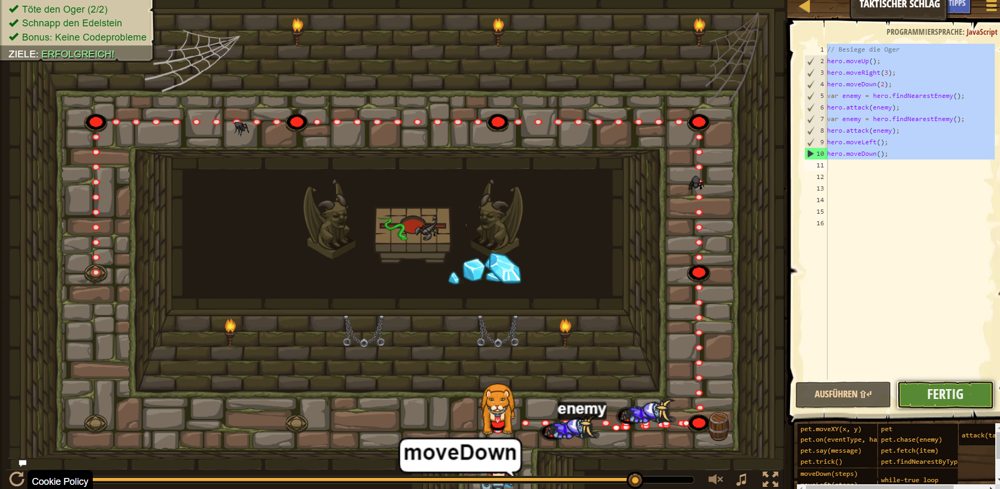

# CodeCombat Welt 1 Markdown
## Level 39 Taktischer Schlag
```
hero.moveUp();
hero.moveRight(3);
hero.moveDown(2);
var enemy = hero.findNearestEnemy();
hero.attack(enemy);
var enemy = hero.findNearestEnemy();
hero.attack(enemy);
hero.moveLeft();
hero.moveDown();
```
