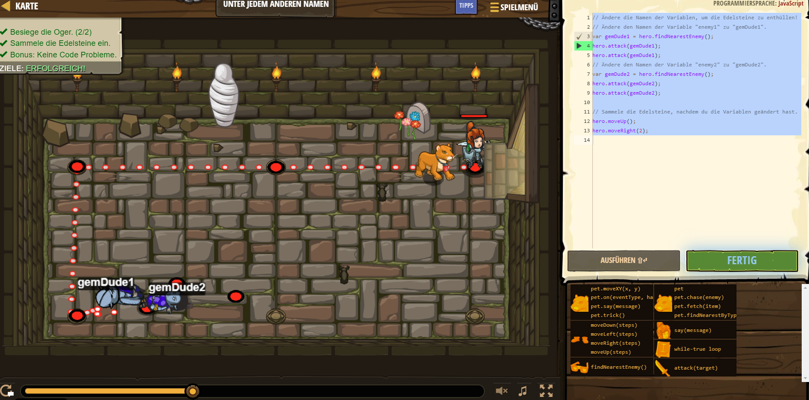

# CodeCombat Welt 1 Markdown
## Level 46 Unter jedem anderen Namen
```
var gemDude1 = hero.findNearestEnemy();
hero.attack(gemDude1);
hero.attack(gemDude1);
var gemDude2 = hero.findNearestEnemy();
hero.attack(gemDude2);
hero.attack(gemDude2);
hero.moveUp();
hero.moveRight(2);
```
