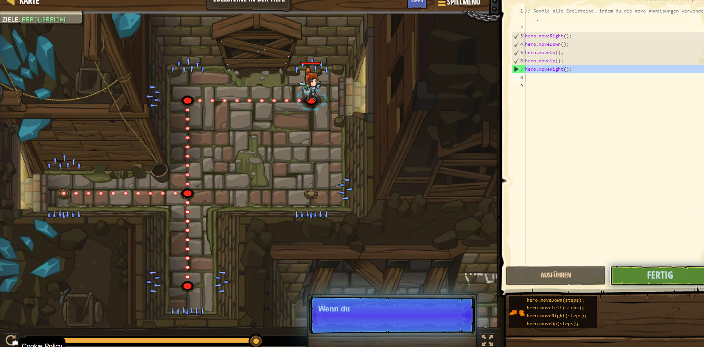

# CodeCombat Welt 1 Markdown
## Level 5 Wahre Namen
### In diesem Level wurde mir beigebracht wie man gegner angreift.
```
hero.moveRight();
hero.attack("Brak");
hero.attack("Brak");
hero.moveRight();
hero.attack("Treg");
hero.attack("Treg");
hero.moveRight(2);
```
