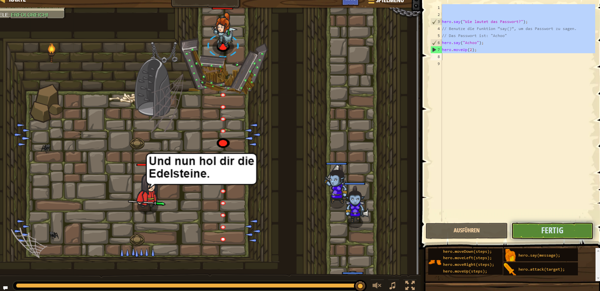

# CodeCombat Welt 1 Markdown
## Level 6 Zellenkommentar
### Hier wurde mir beigebracht wie mein charakter mit anderen Charakteren reden kann.
```
hero.say("Wie lautet das Passwort?");
hero.say("Achoo");
hero.moveUp(2);
```
