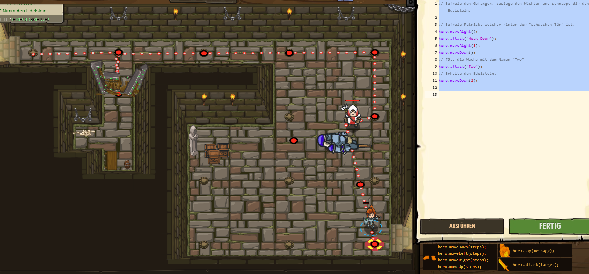

# CodeCombat Welt 1 Markdown
## Level 9 Der Gefangene
```
In diesem Level musste ich eine Tür attackieren, damit ich dem gefangenen befreien konnte.
hero.moveRight(); 
hero.attack("Weak Door");
hero.moveRight(3);
hero.moveDown();
hero.attack("Two");
hero.moveDown(2);
```
