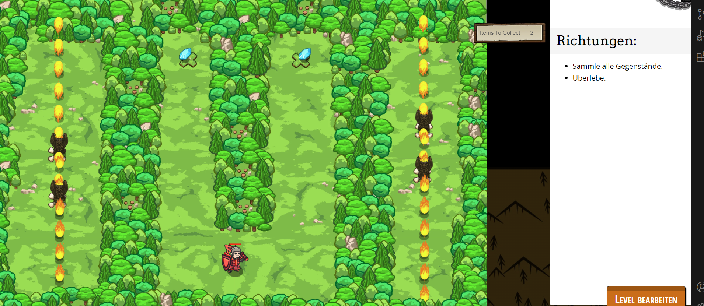

# CodeCombat Welt 2 Markdown
## Level 2 Feuerwerfer
```
var player = game.spawnPlayerXY("knight", 40, 10);
game.addCollectGoal();
game.addSurviveGoal();
game.spawnXY("gem", 32, 55);
game.spawnXY("gem", 51, 55);
var fs1 = game.spawnXY("fire-spewer", 12, 25);
var fs2 = game.spawnXY("fire-spewer", 70, 30);
var fs3 = game.spawnXY("fire-spewer", 12, 35);
var fs4 = game.spawnXY("fire-spewer", 70, 40);
fs1.direction = "vertical";
fs2.direction = "vertical";
fs3.direction = "vertical";
fs4.direction = "vertical";
```
