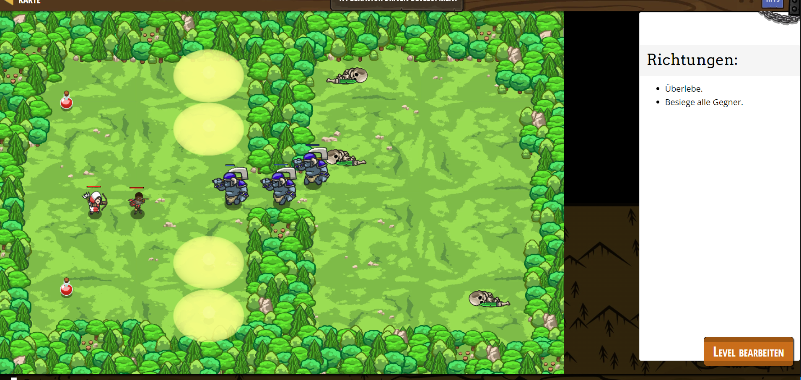

# CodeCombat Welt 2 Markdown 
## Level 17 Behavior Driven Development
```
var skeleton1 = game.spawnXY("skeleton", 60, 48);
var skeleton2 = game.spawnXY("skeleton", 60, 30);
var skeleton3 = game.spawnXY("skeleton", 60, 12);
skeleton1.behavior = "Scampers";
skeleton2.behavior = "Scampers";
// Assign "Scampers" to skeleton3.behavior
skeleton3.behavior = "Scampers";
var ogre1 = game.spawnXY("ogre", 70, 50);
var ogre2 = game.spawnXY("ogre", 70, 30);
var ogre3 = game.spawnXY("ogre", 70, 10);
ogre1.behavior = "AttacksNearest";
ogre2.behavior = "AttacksNearest"
ogre3.behavior = "AttacksNearest"
var archer1 = game.spawnXY("archer", 14, 30);
archer1.behavior = "Defends"
var player = game.spawnPlayerXY("raider", 20, 30);
player.attackDamage = 10;
player.maxHealth = 9001;
game.addSurviveGoal();
game.addDefeatGoal();
game.spawnXY("forest", 40, 10);
game.spawnXY("forest", 40, 18);
game.spawnXY("forest", 40, 26);
game.spawnXY("forest", 40, 42);
game.spawnXY("forest", 40, 50);
game.spawnXY("forest", 40, 58);
game.spawnXY("lightstone", 30, 45);
game.spawnXY("lightstone", 30, 20);
game.spawnXY("lightstone", 30, 55);
game.spawnXY("lightstone", 30, 10);
game.spawnXY("potion-medium", 10, 50);
game.spawnXY("potion-medium", 10, 15);
```
