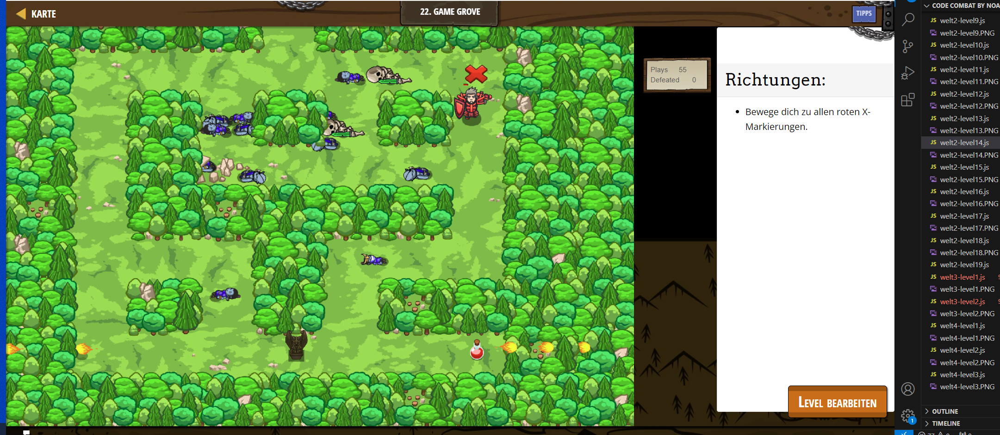

# CodeCombat Welt 2 Markdown 
## Level 19 Seeing is Believing
```
game.spawnMaze("forest", 2);
var player = game.spawnPlayerXY("knight", 12, 18);
player.attackDamage = 10;
player.maxHealth = 500;
game.addMoveGoalXY(60, 60);
game.spawnXY("gem", 28, 27);
game.spawnXY("locked-chest", 44, 28);
game.spawnXY("silver-key", 43, 60);
game.spawnXY("potion-medium", 60, 12);
var s1 = game.spawnXY("skeleton", 43, 50);
s1.behavior = "Defends";
var s2 = game.spawnXY("skeleton", 49, 59);
s2.behavior = "Defends";
game.spawnXY("lightstone", 60, 44);
var gen = game.spawnXY("generator", 26, 44);
gen.spawnType = "munchkin";
gen.spawnDelay = 4;
game.spawnXY("munchkin", 28, 19);
game.spawnXY("thrower", 48, 28);
var spewer = game.spawnXY("fire-spewer", 37, 12);
spewer.direction = "horizontal";
db.add("plays", 1);
ui.track(db, "plays");
ui.track(db, "defeated");
function onVictory(event) {
    db.add("defeated", game.defeated);
}
game.on("victory", onVictory);
```
