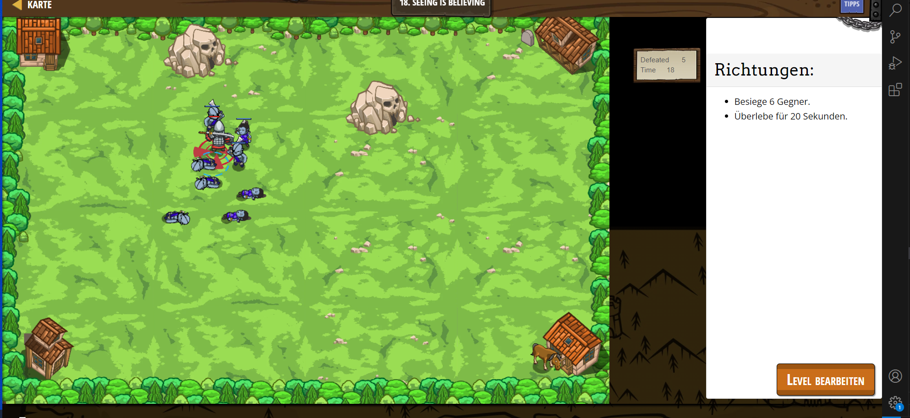

# CodeCombat Welt 2 Markdown 
## Level 20 Game Grove
```
var player = game.spawnPlayerXY("samurai", 20, 20);
var spawner = game.spawnXY("generator", 50, 50);
spawner.maxHealth = 9001;
spawner.spawnType = "munchkin";
var spawner = game.spawnXY("generator", 26, 60);
spawner.maxHealth = 9001;
spawner.spawnType   = "munchkin";
ui.track(game, "defeated")
player.maxSpeed = 10;
player.attackDamage = 100;
game.addDefeatGoal(6); 
ui.track(game, "time");
game.addSurviveGoal(20);
```
