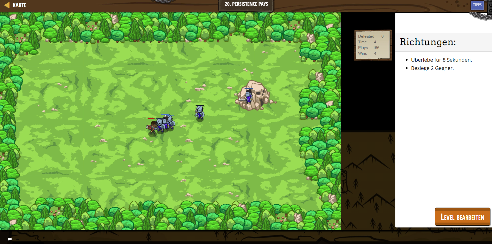

# CodeCombat Welt 2 Markdown 
## Level 22 Persistence Pays
```
var generator = game.spawnXY("generator", 60, 40);
generator.spawnType = "munchkin";
generator.spawnDelay = 1;
var player = game.spawnPlayerXY("raider", 36, 30);
player.maxHealth = 70;
player.attackDamage = 10;
game.addSurviveGoal(8);
game.addDefeatGoal(2);
db.add("plays", 1);
ui.track(db, "plays");
ui.track(db, "wins");
ui.track(game, "defeated");
ui.track(game, "time");
function onVictory(event) {
    db.add("wins", 1);
}
game.on("victory", onVictory);
```
