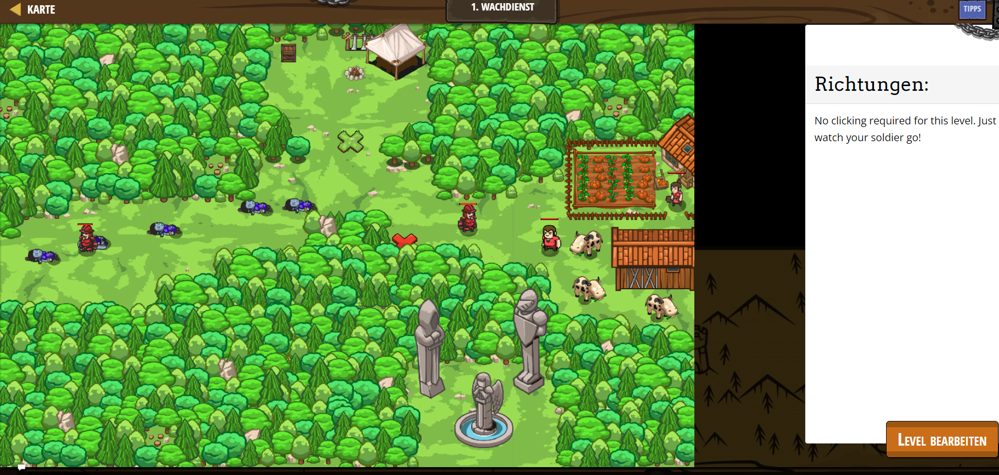

# CodeCombat Welt 2 Markdown 
## Level 23 Wachdienst
```
// Add a soldier to the level to prevent ogres from crossing the path.
// Command the soldier using an event handler function.

function soldierLogic() {
    game.spawnXY("soldier", 55, 35);
    while(true) {
        var enemy = soldier.findNearestEnemy();
        if (enemy) {
            soldier.attack(enemy);
        }
        else {
            game.addMoveGoalXY(48, 33);
        }
    }
}
```
