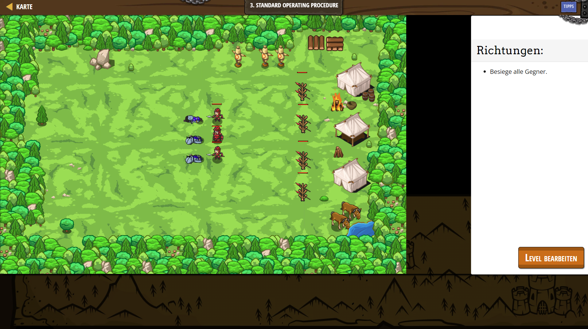

# CodeCombat Welt 2 Markdown 
## Level 26 Standard Operating Procedure
```
game.addDefeatGoal();
var soldier1 = game.spawnXY("soldier", 50, 30);
var soldier2 = game.spawnXY("soldier", 50, 35);
var soldier3 = game.spawnXY("soldier", 50, 40);
var munchkin1 = game.spawnXY("munchkin", 25, 30);
var munchkin2 = game.spawnXY("munchkin", 25, 35);
var munchkin3 = game.spawnXY("munchkin", 25, 40);

function fightEnemies(event) {
    while(true) {
        var enemy = soldier1.findNearestEnemy(); 
        if (enemy) {
        soldier1.attack(enemy);
        }
        
        enemy = soldier2.findNearestEnemy(); 
        if (enemy) {
        soldier2.attack(enemy);
        }
        
        enemy = soldier3.findNearestEnemy(); 
        if (enemy) {
        soldier3.attack(enemy);
        }
        enemy = munchkin1.findNearestEnemy(); // ∆
        if(enemy) {
        munchkin1.attack(enemy); // ∆
        }
        enemy = munchkin2.findNearestEnemy(); // ∆
        if(enemy) {
        munchkin2.attack(enemy); // ∆
        }
        enemy = munchkin3.findNearestEnemy(); // ∆
        if(enemy) {
        munchkin3.attack(enemy); // ∆
        }
    }
}
game.setActionFor("munchkin", "spawn", fightEnemies);
game.setActionFor("soldier", "spawn", fightEnemies);
```
