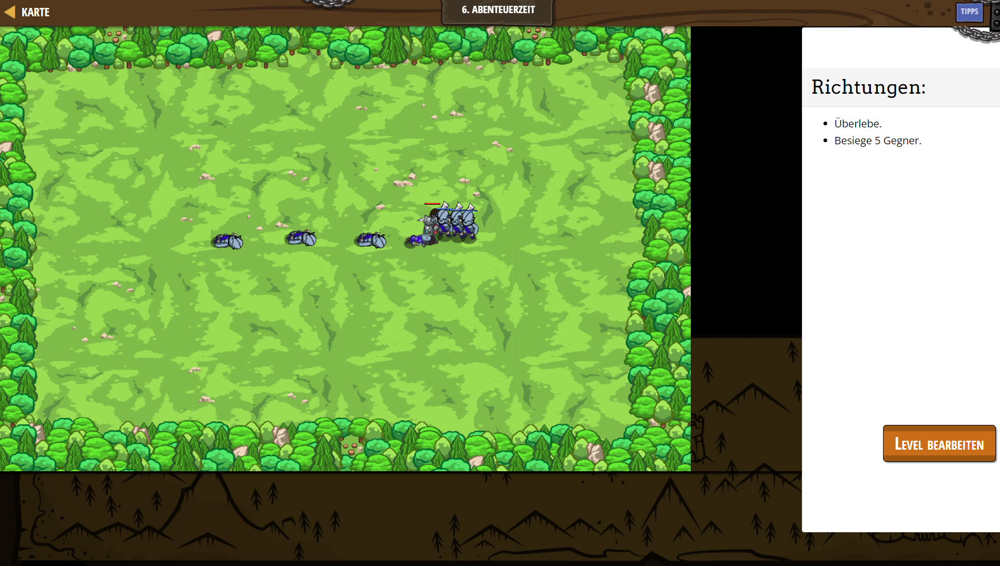

# CodeCombat Welt 2 Markdown 
## Level 28 Abenteuerzeit
```
game.spawnPlayerXY("guardian", 10, 35);
game.addSurviveGoal();
game.addDefeatGoal(5);

function onSpawn(event) {
    while(true) {
        var unit = event.target;
        var enemy = unit.findNearestEnemy();
        if(enemy) {
            unit.attack(enemy);
        }
    }
}

game.setActionFor("munchkin", "spawn", onSpawn);
var spawnTime = 0;
while(true) {
    if(game.time > spawnTime) {
        game.spawnXY("munchkin", 60, 35);
       spawnTime = game.time + 2;
    }
}
```
