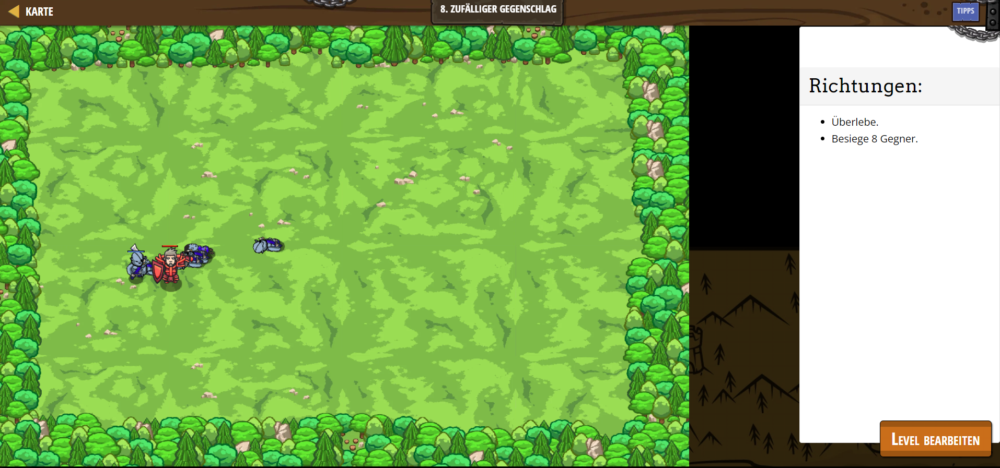

# CodeCombat Welt 2 Markdown 
## Level 29 Zufälliger Gegenschlag
```
game.spawnPlayerXY("knight", 40, 35);
game.addSurviveGoal();
game.addDefeatGoal(8);

function onSpawn(event) {
    while(true) {
        var unit = event.target;
        var enemy = unit.findNearestEnemy();
        if(enemy) {
            unit.attack(enemy);
        }
    }
}

game.setActionFor("munchkin", "spawn", onSpawn);
var spawnTime = 0;
while(true) {
    if(game.time > spawnTime) {
        var x = game.randomInteger(10, 70);
        game.spawnXY("munchkin", 11, 30);
        spawnTime = game.time + game.randomInteger(0,4);
    }
}
```
