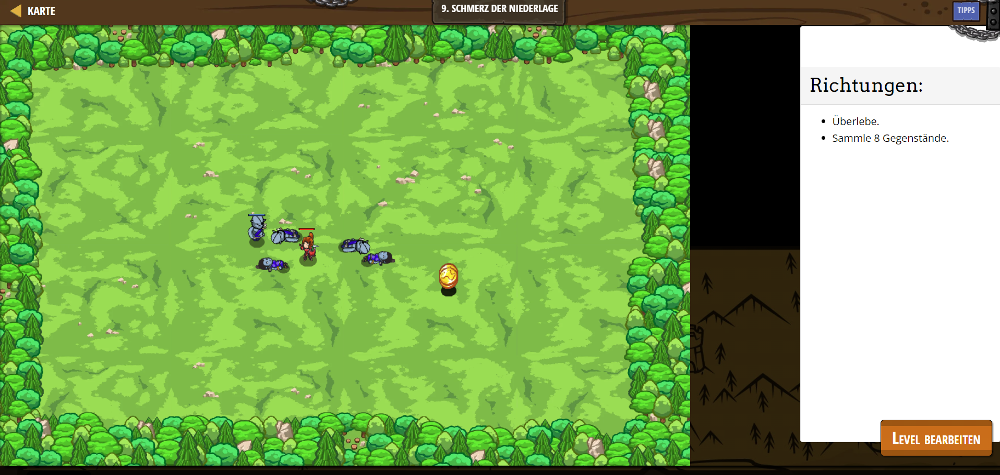

# CodeCombat Welt 2 Markdown 
## Level 30 Schmerz der Niederlage
```
game.spawnPlayerXY("captain", 40, 35);
game.addSurviveGoal();
game.addCollectGoal(8);

function onSpawn(event) {
    while(true) {
        var unit = event.target;
        var enemy = unit.findNearestEnemy();
        if(enemy) {
            unit.attack(enemy);
        }
    }
}
function onDefeat(event) {
    var unit = event.target;
    var x = unit.pos.x + game.randomInteger(-5, 5);
    y = unit.pos.y + game.randomInteger(-5, 5);
    game.spawnXY("gold-coin", 52, 27);
}

game.setActionFor("munchkin", "spawn", onSpawn);
game.setActionFor("munchkin", "defeat", onDefeat);

var spawnTime = 0;
while(true) {
    if(game.time > spawnTime) {
        var x = game.randomInteger(10, 70);
        var y = game.randomInteger(10, 60);
        game.spawnXY("munchkin", x, y);
        spawnTime = game.time + game.randomInteger(1,8);
    }
}
```
