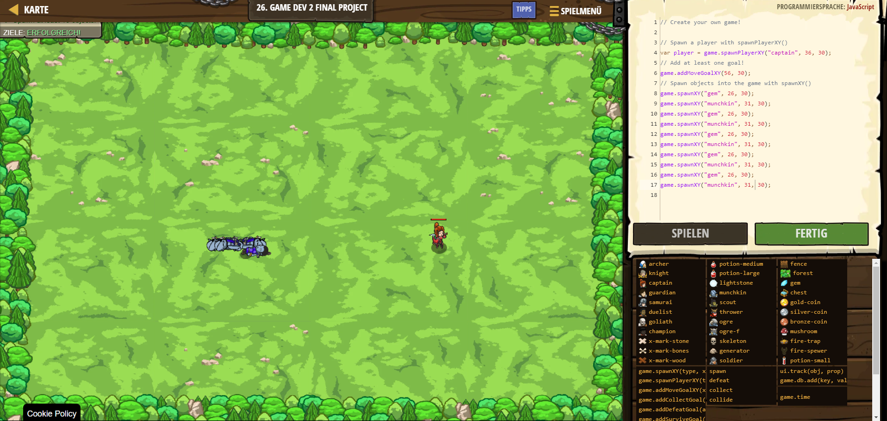

# CodeCombat Welt 2 Markdown 
## Level 31 Game Dev 2 Final Project
```
var player = game.spawnPlayerXY("captain", 36, 30);
game.addMoveGoalXY(56, 30);
game.spawnXY("gem", 26, 30);
game.spawnXY("munchkin", 31, 30);
game.spawnXY("gem", 26, 30);
game.spawnXY("munchkin", 31, 30);
game.spawnXY("gem", 26, 30);
game.spawnXY("munchkin", 31, 30);
game.spawnXY("gem", 26, 30);
game.spawnXY("munchkin", 31, 30);
game.spawnXY("gem", 26, 30);
game.spawnXY("munchkin", 31, 30);
```
