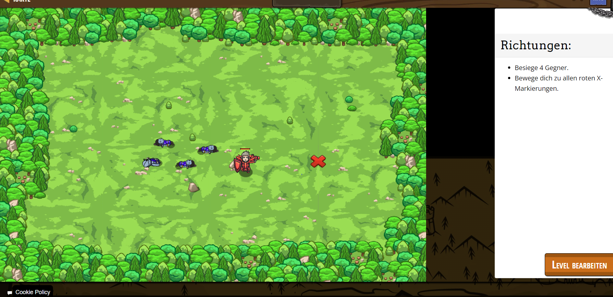

# CodeCombat Welt 2 Markdown
## Level 8 Zerbrösel es
```
var player = game.spawnPlayerXY("knight", 36, 30);
game.addDefeatGoal(4);
game.addMoveGoalXY(60, 30)
game.spawnXY("munchkin", 40, 10);
game.spawnXY("munchkin", 63, 40);
game.spawnXY("munchkin", 36, 50);
game.spawnXY("munchkin", 15, 30);
```
