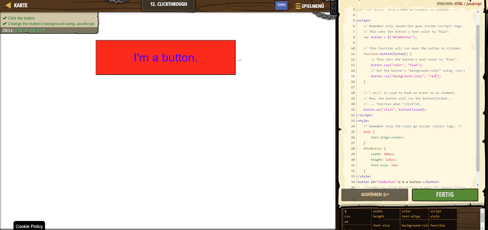

# CodeCombat Welt 3 Markdown
## Level 14 Clickthrough
```
<!-- It is possible to make your website interactive! -->
<!-- jQuery includes ".on()" to watch for events. -->
<!-- The "click" occurs when an element is clicked. -->

<script>
    var button = $("#theButton");

    function buttonClicked() {
        button.css("color", "blue");
        button.css("background-color", "red"); 
    }

    button.on("click", buttonClicked);
</script>
<style>
    /* Remember only CSS rules go inside <style> tags. */
    body {
        text-align:center;
    }
    #theButton {
        width: 500px;
        height: 125px;
        font-size: 3em;
    }
</style>
<button id="theButton">I'm a button.</button>
<!-- Remember to click the button to make the change happen --> --></style>
```
