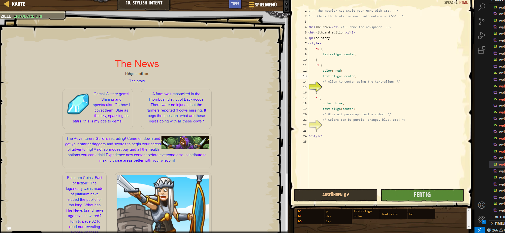

# CodeCombat Welt 3 Markdown
## Level 8 Stylish Intent
```
<!-- The <style> tag style your HTML with CSS. -->
<!-- Check the hints for more information on CSS! -->

<h1>The News</h1> <!-- Name the newspaper. -->
<h6>Kithgard edition.</h6>
<p>The story
<style>
    h6 {
        text-align: center;
    }
    h1 {
        color: red;
        text-align: center;
        /* Align to center using the text-align: */
        
    }
    p {
        color: blue;
        text-align:center;
        /* Give all paragraph text a color: */
        /* Colors can be purple, orange, blue, etc! */
        
    }
</style>
```
