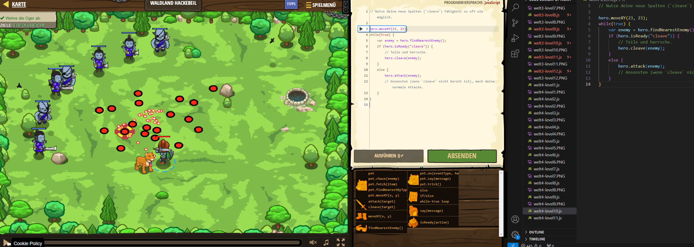

# CodeCombat Welt 4 Markdown
## Level 10 Waldland Hackebeil
```
hero.moveXY(23, 23);
while(true) {
    var enemy = hero.findNearestEnemy();
    if (hero.isReady("cleave")) {
        // Teile und herrsche.
        hero.cleave(enemy);
    }
    else {
        hero.attack(enemy);
    }
}
```
