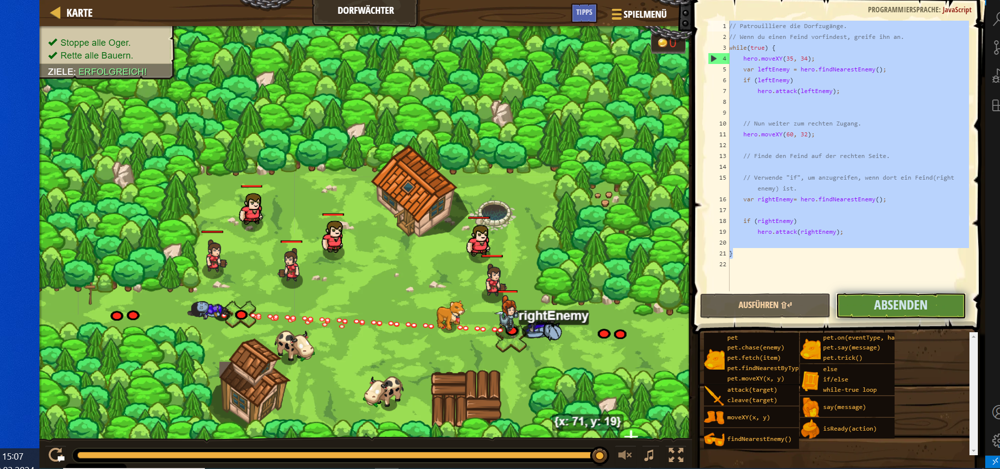

# CodeCombat Welt 4 Markdown
## Level 14 Dorfwächter
```
while(true) {
    hero.moveXY(35, 34);
    var leftEnemy = hero.findNearestEnemy();
    if (leftEnemy) 
        hero.attack(leftEnemy);
    hero.moveXY(60, 32);
    var rightEnemy= hero.findNearestEnemy();
    if (rightEnemy)  
        hero.attack(rightEnemy);  
    }
```
