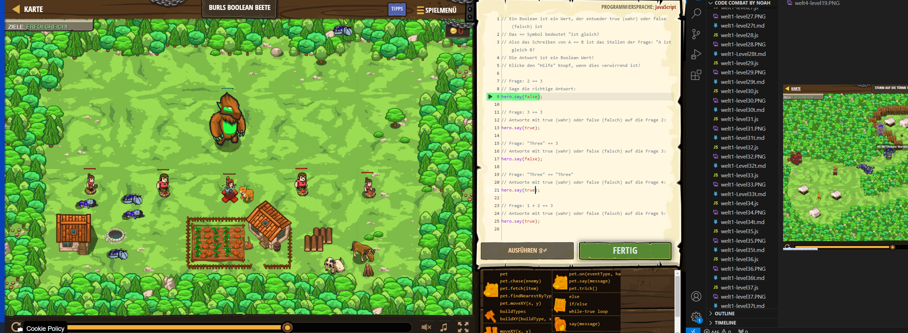

# CodeCombat Welt 4 Markdown
## Level 20 Burls Boolean Beete
```
// Frage: 2 == 3 
hero.say(false);

// Frage: 3 == 3
hero.say(true);

// Frage: "Three" == 3
hero.say(false);

// Frage: "Three" == "Three"
hero.say(true);

// Frage: 1 + 2 == 3
hero.say(true);
```
