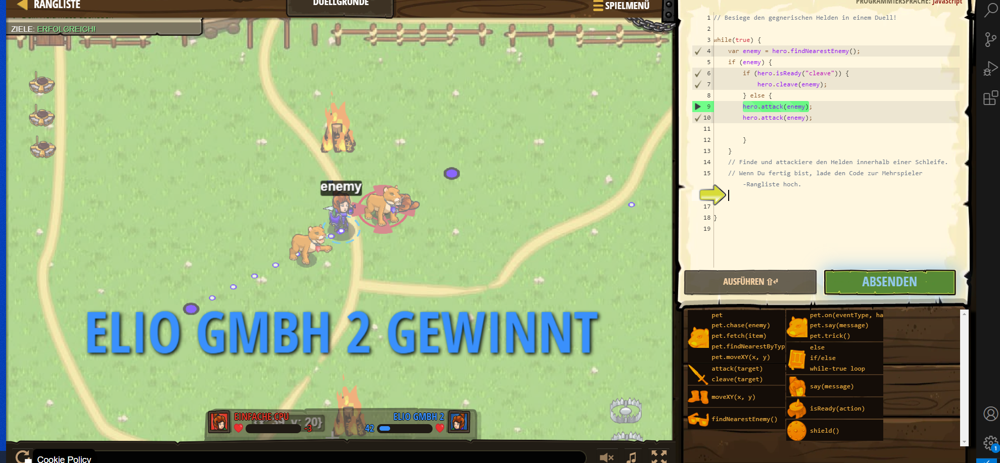

# CodeCombat Welt 4 Markdown
## Level 23 Duellgründe
```
while(true) {
    var enemy = hero.findNearestEnemy();
    
    // Benutze ein if-Statement mit isReady, um „spalten“ zu überprüfen:
    if (enemy) {
         if (hero.isReady("cleave")) {
       hero.cleave(enemy);
       } else {
            hero.attack(enemy);
        } 
    }
}
```
