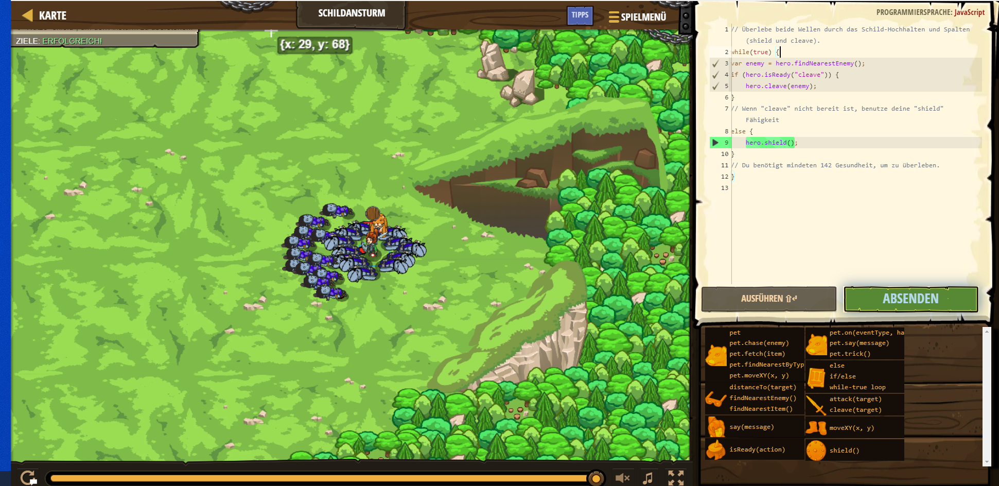

# CodeCombat Welt 4 Markdown
## Level 26 Schildansturm
```
while(true) {
    var enemy = hero.findNearestEnemy();
    if (hero.isReady("cleave")) {
        hero.cleave(enemy);
    } 
    else {
    hero.shield();
    }
    }
```
