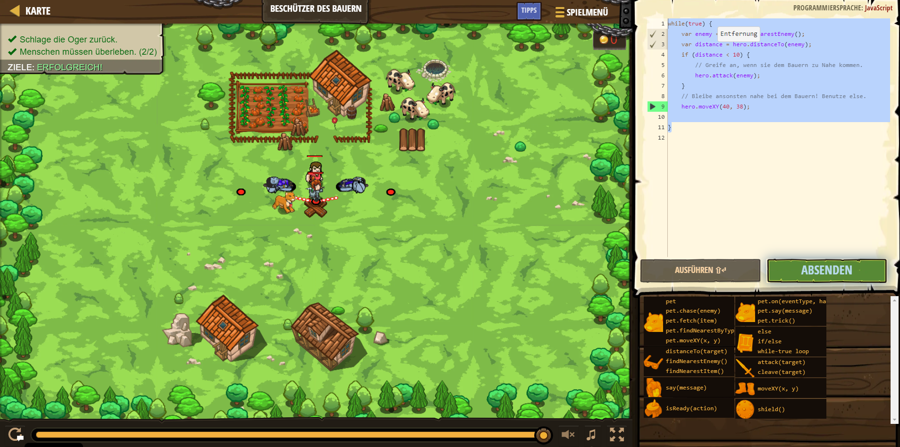

# CodeCombat Welt 4 Markdown
## Level 29 Beschützer des Bauern
```
while(true) {
    var enemy = hero.findNearestEnemy();
    var distance = hero.distanceTo(enemy);
    if (distance < 10) {
    hero.attack(enemy);
    }
    hero.moveXY(40, 38);
}
```
