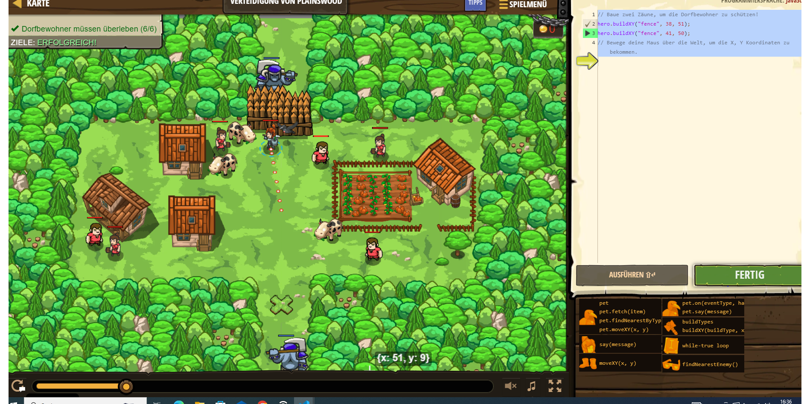

# CodeCombat Welt 3 Markdown
## Level 2 Verteidigung von Plainswood
```
hero.buildXY("fence", 38, 51);
hero.buildXY("fence", 41, 50);
// Bewege deine Maus über die Welt, um die X, Y Koordinaten zu bekommen.
```
