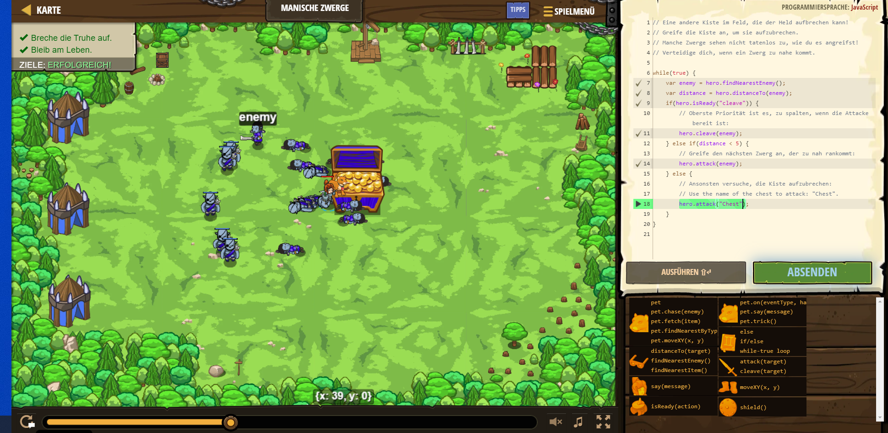

# CodeCombat Welt 4 Markdown
## Level 30 Manische Zwerge
```
while(true) {
    var enemy = hero.findNearestEnemy();
    var distance = hero.distanceTo(enemy);
    if(hero.isReady("cleave")) {
        hero.cleave(enemy);
    } else if(distance < 5) {
        hero.attack(enemy);
    } else {
        hero.attack("Chest");
    }
}
```
