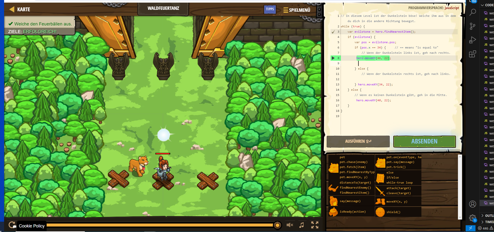

# CodeCombat Welt 4 Markdown
## Level 31 Waldfeuertanz
```
while (true) {
    var evilstone = hero.findNearestItem();
    if (evilstone) {
    var pos = evilstone.pos;
    if (pos.x == 34) {     // == means "is equal to"
         hero.moveXY(46, 22);
          
    } else {
        } hero.moveXY(34, 22);
    } else {
         hero.moveXY(40, 22); 
    }
}
```
