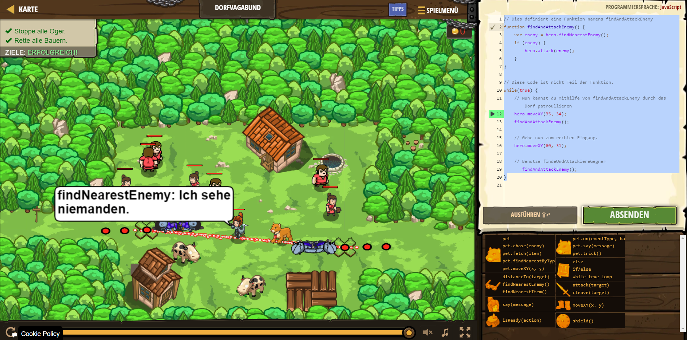

# CodeCombat Welt 4 Markdown
## Level 32 Dorfvagabund
```
// Dies definiert eine Funktion namens findAndAttackEnemy
function findAndAttackEnemy() {
    var enemy = hero.findNearestEnemy();
    if (enemy) {
        hero.attack(enemy);
    }
}

// Diese Code ist nicht Teil der Funktion.
while(true) {
    hero.moveXY(35, 34);
    findAndAttackEnemy();
    hero.moveXY(60, 31);
       findAndAttackEnemy();
}
```
