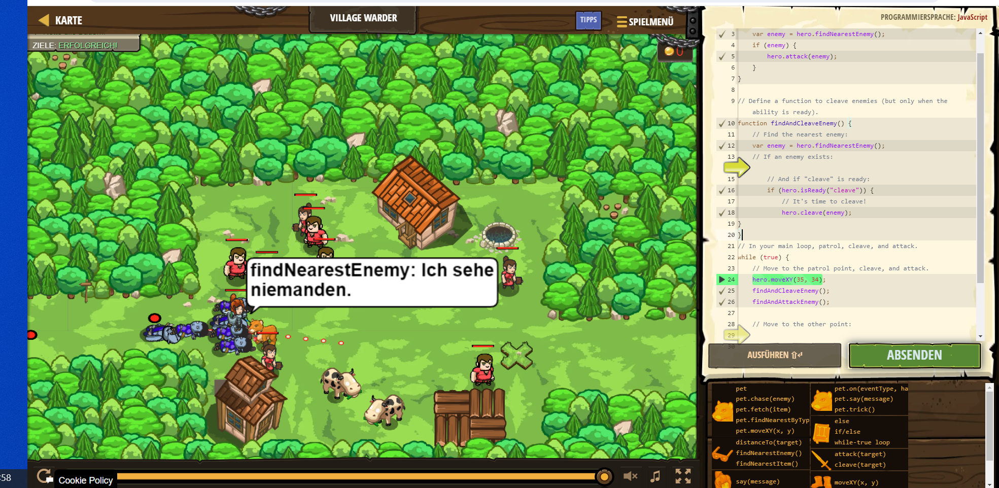

# CodeCombat Welt 4 Markdown
## Level 33 Dorfvagabund
```
function findAndAttackEnemy() {
    var enemy = hero.findNearestEnemy();
    if (enemy) {
    hero.attack(enemy);
    }
}

function findAndCleaveEnemy() {
    var enemy = hero.findNearestEnemy();
    if (hero.isReady("cleave")) {
        hero.cleave(enemy);
}
}
while (true) {
    hero.moveXY(35, 34);
    findAndCleaveEnemy();
    findAndAttackEnemy();  
}
```
