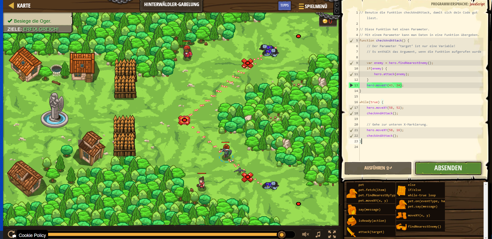

# CodeCombat Welt 4 Markdown
## Level 34 Hinterwäldler-Gabelung
```
function checkAndAttack() {
    // Der Parameter ‘target‘ ist nur eine Variable!
    // Es enthält das Argument, wenn die Funktion aufgerufen wurde
    
    var enemy = hero.findNearestEnemy();
    if(enemy) {
        hero.attack(enemy);
    }
    hero.moveXY(43, 34);
}

while(true) {
    hero.moveXY(58, 52);
    checkAndAttack();
}
```
