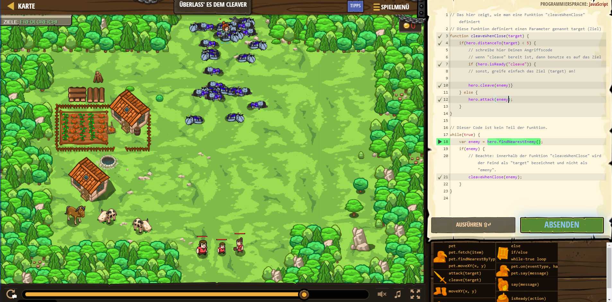

# CodeCombat Welt 4 Markdown
## Level 35 Überlass' es dem Cleaver
```
function cleaveWhenClose(target) {
    if(hero.distanceTo(target) < 5) {
        // schreibe hier Deinen Angriffscode
        // wenn "cleave" bereit ist, dann benutze es auf das Ziel
        if (hero.isReady("cleave")) {
        // sonst, greife einfach das Ziel (target) an!
       
        hero.cleave(enemy)}
    } else {
        hero.attack(enemy);
    }
}
while(true) {
    var enemy = hero.findNearestEnemy();
    if(enemy) {
    cleaveWhenClose(enemy);
    }
}
```
