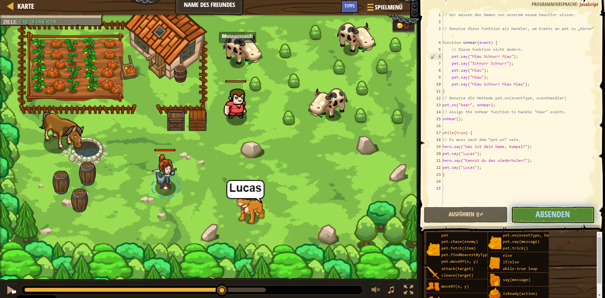

# CodeCombat Welt 4 Markdown
## Level 39 Name des Freundes
```
function onHear(event) {
    pet.say("Miau Schnurr Miau");
    pet.say("Schnurr Schnurr");
    pet.say("Miau");
    pet.say("Miau");
    pet.say("Miau Schnurr Miau Miau");
}
pet.on("hear", onHear);
onHear();

while(true) {
hero.say("Was ist dein Name, Kumpel?");
pet.say("Lucas");
hero.say("Kannst du das wiederholen?");
pet.say("Lucas");
}
```
