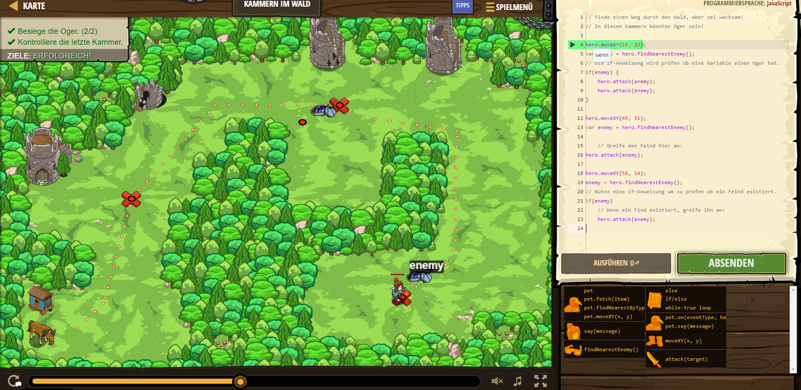

# CodeCombat Welt 3 Markdown
## Level 3 Kammern im Wald
```
hero.moveXY(19, 33);
var enemy = hero.findNearestEnemy();
if(enemy) {
    hero.attack(enemy);
    hero.attack(enemy);
}

hero.moveXY(49, 51);
var enemy = hero.findNearestEnemy();
    
    // Greife den Feind hier an:
hero.attack(enemy);

hero.moveXY(58, 14);
enemy = hero.findNearestEnemy();
if(enemy)
    hero.attack(enemy);
```
