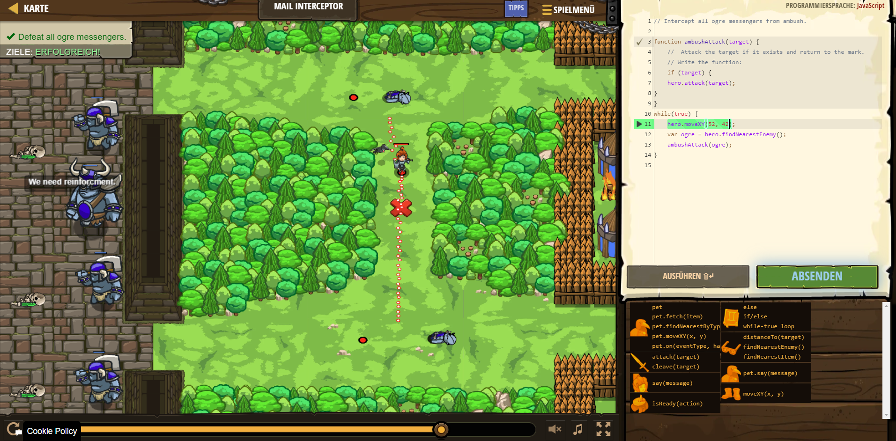

# CodeCombat Welt 4 Markdown
## Level 42 Mail Interceptor
```
function ambushAttack(target) {
    //  Attack the target if it exists and return to the mark.
    // Write the function:
    if (target) {
    hero.attack(target);
}
}
while(true) {
    hero.moveXY(52, 42);
    var ogre = hero.findNearestEnemy();
    ambushAttack(ogre);
}
```
