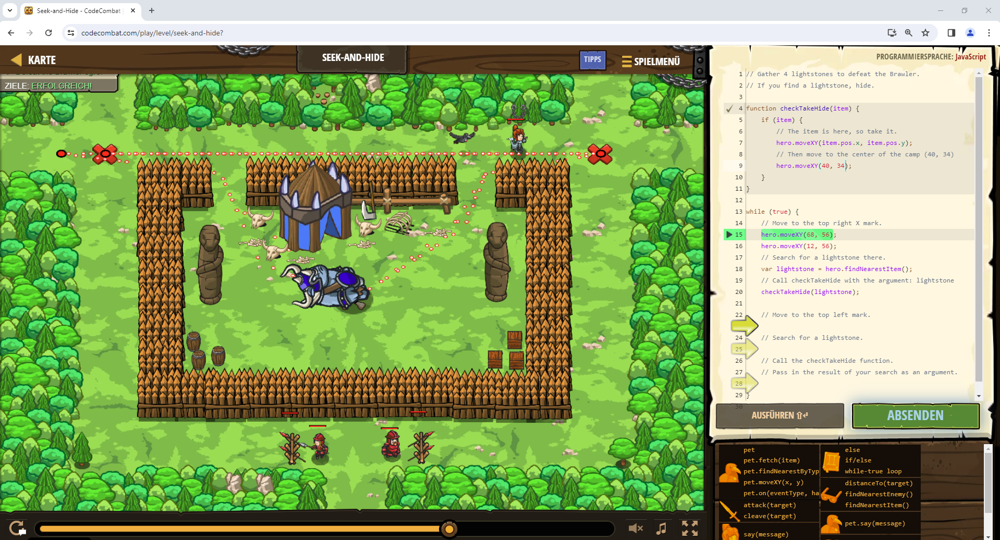

# CodeCombat Welt 4 Markdown
## Level 43 Seek-and-Hide
```
function checkTakeHide(item) {
    if (item) {
        hero.moveXY(item.pos.x, item.pos.y);
    }
}

while (true) {

    hero.moveXY(68, 56);
    hero.moveXY(12, 56);
    var lightstone = hero.findNearestItem();
    checkTakeHide(lightstone);
}
```
