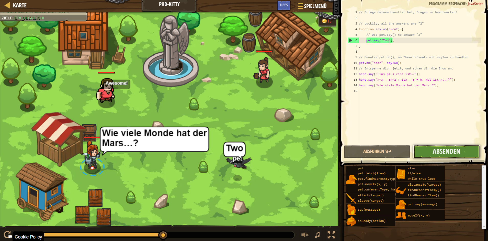

# CodeCombat Welt 4 Markdown
## Level 47 PhD-Kitty
```
function sayTwo(event) {
    // Use pet.say() to answer "2"
    pet.say("Two");
}

// Benutze pet.on(), um “hear“-Events mit sayTwo zu handlen
pet.on("hear", sayTwo);
// Entspanne dich jetzt, und schau dir die Show an.
hero.say("Eins plus eins ist…?");
hero.say("x^3 - 6x^2 + 12x - 8 = 0. Was ist x...?");
hero.say("Wie viele Monde hat der Mars…?");
```
