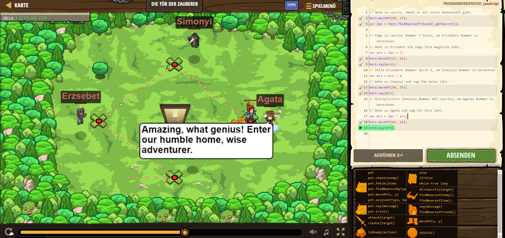

# CodeCombat Welt 4 Markdown
## Level 50 Die Tür der Zauberer
```
hero.moveXY(30, 13);
var las = hero.findNearestFriend().getSecret();
var erz = las + 7;
hero.moveXY(17, 26);
hero.say(erz);
var erz = erz / 4
hero.moveXY(30, 39);
hero.say(erz);
var erz = las * erz;
hero.moveXY(43, 26);
hero.say(erz);
```
