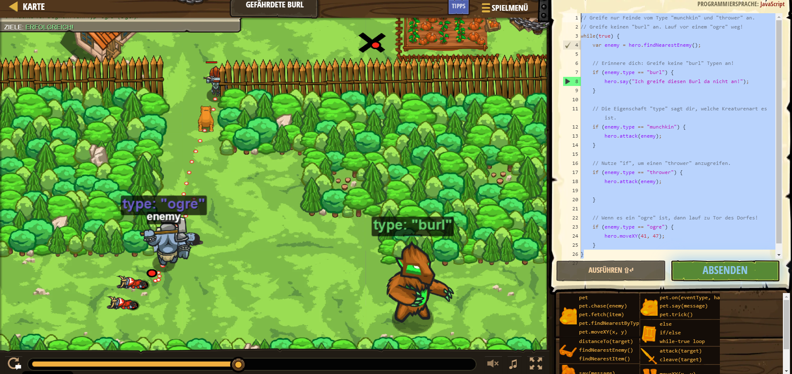

# CodeCombat Welt 4 Markdown
## Level 52 Gefährdete Burl
```
while(true) {
    var enemy = hero.findNearestEnemy();
    
    // Erinnere dich: Greife keine "burl" Typen an!
    if (enemy.type == "burl") {
        hero.say("Ich greife diesen Burl da nicht an!");
    }
    
    // Die Eigenschaft "type" sagt dir, welche Kreaturenart es ist.
    if (enemy.type == "munchkin") {
        hero.attack(enemy);
    }
    
    // Nutze "if", um einen "thrower" anzugreifen.
    if (enemy.type == "thrower") {
        hero.attack(enemy);
        
    }
    
    // Wenn es ein "ogre" ist, dann lauf zu Tor des Dorfes!
    if (enemy.type == "ogre") {
        hero.moveXY(41, 47);
    }
}
```
