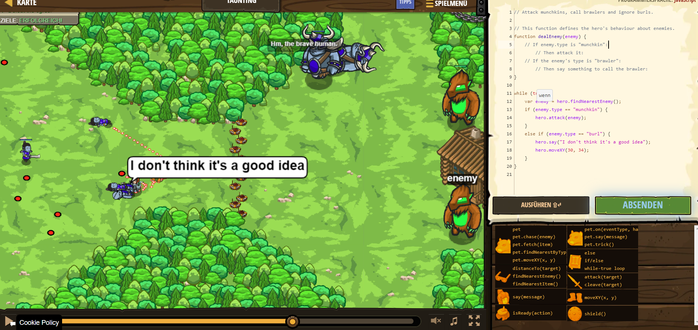

# CodeCombat Welt 4 Markdown
## Level 54 Taunting
```
function dealEnemy(enemy) {
}

while (true) {
    var enemy = hero.findNearestEnemy();
    if (enemy.type == "munchkin") {
        hero.attack(enemy);
    }
    else if (enemy.type == "burl") {
        hero.say("I don't think it's a good idea");
        hero.moveXY(30, 34);
    }
}
```
