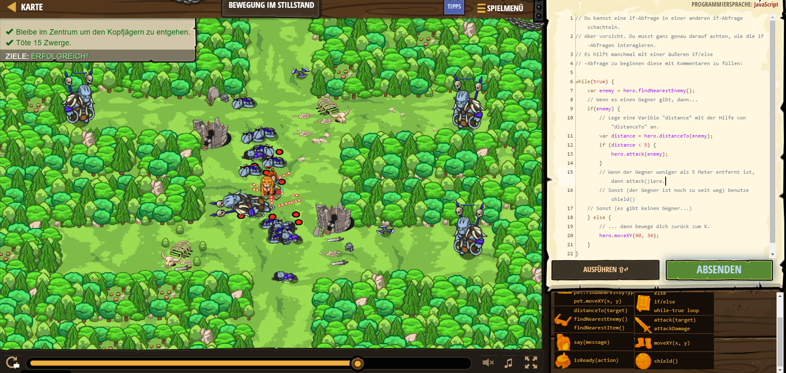

# CodeCombat Welt 4 Markdown
## Level Bewegung im Stillstand
```
while(true) {
    var enemy = hero.findNearestEnemy();
    // Wenn es einen Gegner gibt, dann...
    if(enemy) {
        // Lege eine Varible "distance" mit der Hilfe von "distanceTo" an.
        var distance = hero.distanceTo(enemy);
        if (distance < 5) {
            hero.attack(enemy);
        }

    } else {
        // ... dann bewege dich zurück zum X.
        hero.moveXY(40, 34);
    }
}
```
