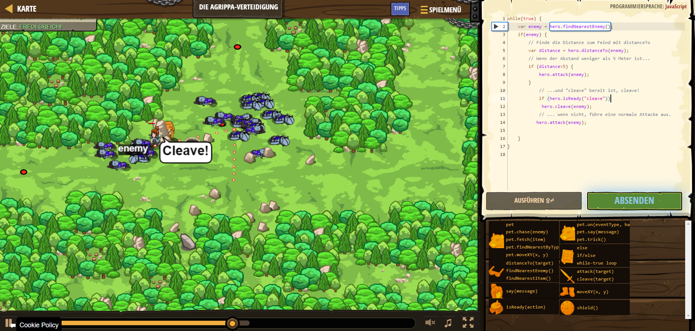

# CodeCombat Welt 4 Markdown
## Level 56 Die Agrippa-Verteidigung
```
while(true) {
    var enemy = hero.findNearestEnemy();
    if(enemy) {
        var distance = hero.distanceTo(enemy);
        if (distance<5) {
            hero.attack(enemy);
        }
            if (hero.isReady("cleave"))
             hero.cleave(enemy);
           hero.attack(enemy);
            
    }
}
```
