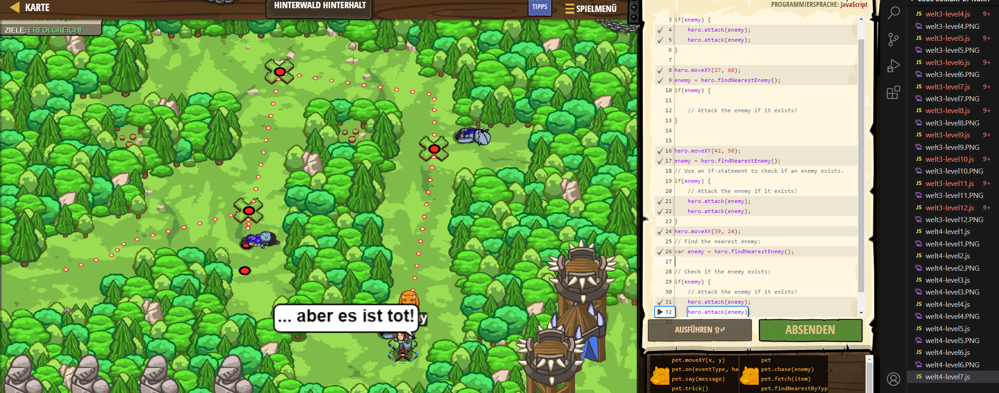

# CodeCombat Welt 3 Markdown
## Level 7 Hinterwald Hinterhalt
```
hero.moveXY(24, 42);
var enemy = hero.findNearestEnemy();
if(enemy) {
    hero.attack(enemy);
    hero.attack(enemy);
}

hero.moveXY(27, 60);
enemy = hero.findNearestEnemy();
if(enemy) {
  
    // Attack the enemy if it exists!
}
 

hero.moveXY(42, 50);
enemy = hero.findNearestEnemy();
if(enemy) {
    hero.attack(enemy);
    hero.attack(enemy);
}
hero.moveXY(39, 24);
var enemy = hero.findNearestEnemy();
if(enemy) {
    hero.attack(enemy);
    hero.attack(enemy);
}
```
