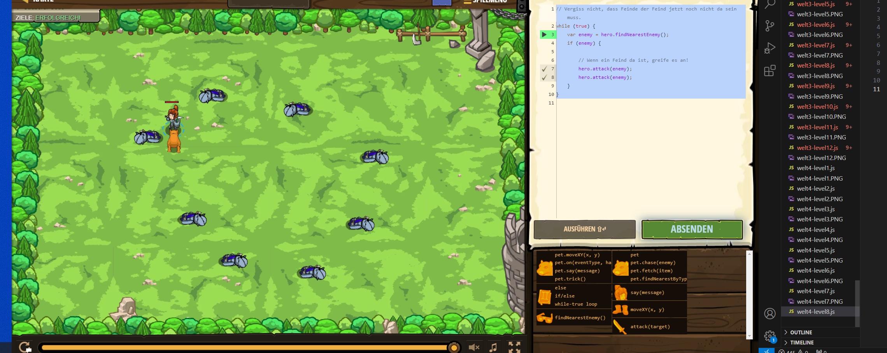

# CodeCombat Welt 3 Markdown
## Level 8 Patrouillenmeister 
```
while (true) {
    var enemy = hero.findNearestEnemy();
    if (enemy) {
        
        // Wenn ein Feind da ist, greife es an!
        hero.attack(enemy);
        hero.attack(enemy);
    }
}
```
