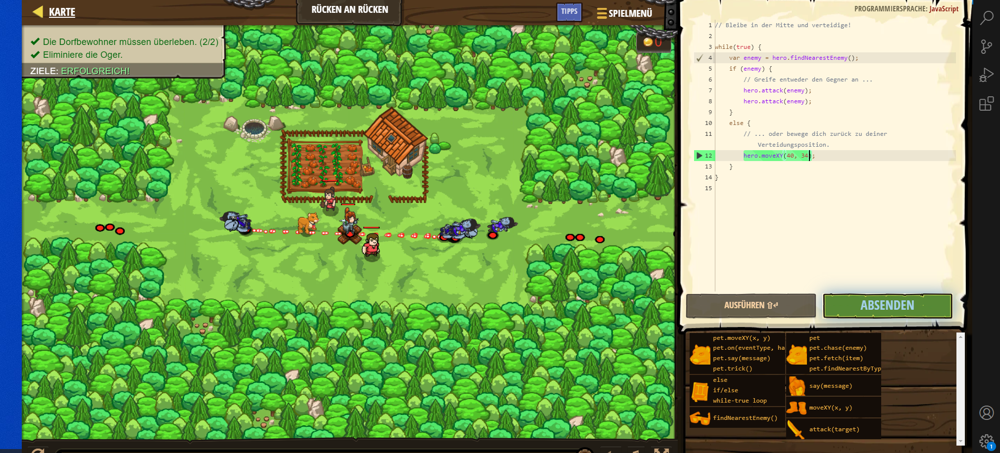

# CodeCombat Welt 3 Markdown
## Level 9 Rücken an Rücken
```
while(true) {
    var enemy = hero.findNearestEnemy();
    if (enemy) {
        hero.attack(enemy);
        hero.attack(enemy);
    }
    else {
        hero.moveXY(40, 34);
    }
}
```
